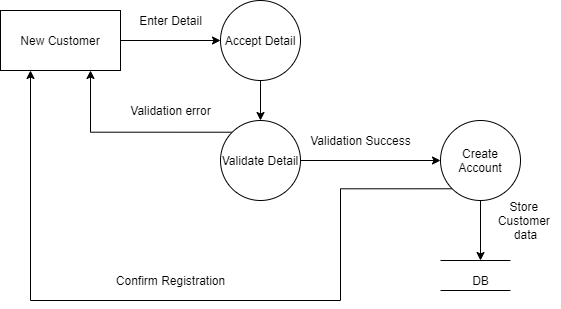
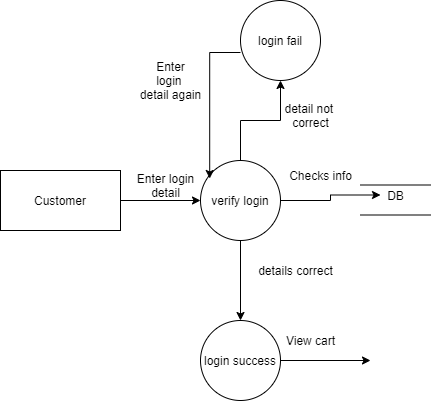
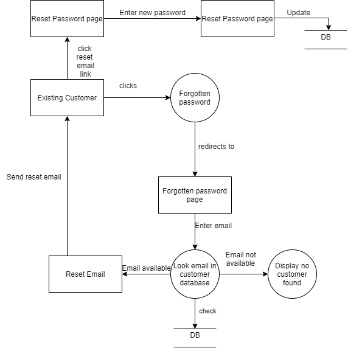
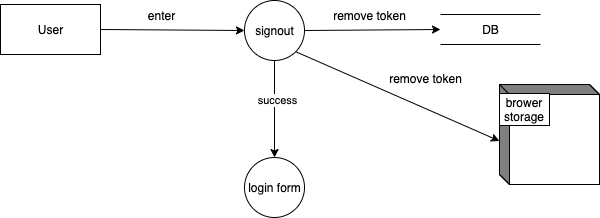

# Background

The Web Application has been designed for our client Himalayan Food Mantra (YDR Hospitality Group Pvt. Ltd.), which is a big company based on Food Industry introducing various tastes and recipes all around the world.

The food company, Himalayan Food Mantra has been offering a vast range of food services and taste to the customers who are widely looking for an optimum personalized experience with pleasure on each lift of their spoons. Having a diverse nature of customers, the hospitality agency uses its digital platforms in order to reach out to a wider section of the audience, which in turn helps in the growth of the organization through profitability and productivity.

# Problem Analysis

## Fish Bone Diagram

# Goals and Objectives

The goals and objectives of the web application are well- laid as below:

- To create a user- friendly interface for a hospitality business for visualizing and selling of various food items via online.
- To develop mobile responsive web application.
- To allow role- based activities for the admins and customers.
- To allow the customers to view and place the order for different food items from the given list of catering.
- To allow customers to view menu page by scanning the QR code provided on the table.
- To be able to calculate the price as well as show the status of the order through the web.
- To make the bookings and reservations of the function halls via the online interfaces
- To allow the admin to add and update the products and other items as and when required.
- TO allow admin to visualize the admin dashboard that includes the information’s about ongoing business scenarios.
- To provide an efficient mechanism of promotion for the products, mostly new food items.
- To provide the mechanism for latest news.
- To host the final web application on the server.

## Success Criteria

The success criteria for the web application development process have been well- defined. The project will be considered successful if:

- The web application shows the products to the customers, and they can place orders.
- The web application is secured for processing the payment for the received orders.
- The web application is as per the requirement of the client and can easily be modified by the client whenever required.
- The project is completed on time.
- Developed web application is mobile responsive.
- The project meets all the functional requirements.
- The project meets all the business requirements.
- The project has been developed within the required scope.

# Project Methodology

The agile software development cycle has been implemented in this process which goes through a well- laid structure of the process which includes meeting, planning, designing, testing, and evaluating the project approach. The designing and development of this brand- new web application for the client business who are presumed to be having very little knowledge about technology that we have used. Therefore, taking the responsibility of communicating all the aspects of the design and development with the client on a weekly basis as well as asking if there are any modifications or changes, they want to implement in the plan is an essential part of our project approach. We constantly worked on constructive reviews from the client necessary strategies to make the most of our resources and skills and giving out the best results to the client.

# Requirement Specification

The very first thing that was done while starting with the project is the collection of client’s requirements. Based on these requirements, user stories were created, and user stories were used to create the UML diagrams that specifies the requirements. All user stories were revised, and changes were made whenever required.

## User Stories

Below are the user stories that were created based on the client’s requirements. Acceptance criteria for each of the user stories are also provided.

1. As a Customer, I should be able to view all the food items provided by the restaurant along with its recipes.

Acceptance criteria:

- Given that the customer is on the home page, s/he should be able to see the menu provided by restaurant.
- When hovering over the food item, customer should be able to see the main ingredient tooltip.

2. As a Customer, I should be able to select one or multiple food items to place order later.

Acceptance criteria:

- Given that the customer is on the home page, s/he should view the food items and add to the cart.
- Even after adding the item to cart, customer should be able to see the menu for more order and keep on adding to the cart.

3. As a customer, I should be able to add products to the cart.

Acceptance Criteria

- Given that the customer is on menu page, s/he should be able to add the items showed on that page to the cart by clicking add to cart button.

4. As a Customer, I should be able to proceed the checkout of the selected items.

Acceptance criteria:

- After a customer adds the food items into the cart, s/he should be able to proceed with the order by clicking the CHECKOUT button.

5. As a customer, I should be able to make a secure payment for the items being ordered.

Acceptance criteria:

- User should be able to enter his/her card details and payment is proceed through secured payment gateway for the items that has been ordered by customer.

6. As an Admin, I need to receive a push notification of the order placed.

Acceptance criteria:

- Given that the admin at dashboard, s/he should be able to receive the push notification of the order in details placed by customer.

7. As an admin, I should be able to update the status of the order.

Acceptance criteria:

- Given that the admin at dashboard, s/he should be able to change the status of the order as being prepared or ready for pick up or order picked up for the customer and the restaurant staff.

8. As an admin, I should be able to manage categories as per required.

Acceptance criteria:

- Given that the admin at the dashboard should be able to update the new categories that are to be launched, remove the outdated items, and edit the price and details of the food item.

9. As an admin, I should be able to manage products as per required.

Acceptance criteria:

- Given that the admin at the dashboard should be able to update the new products that are to be launched, remove the outdated items, and edit the price and details of the food item.

10. As an admin, I should be able to manage new news dynamically for websites.

Acceptance Criteria:

- Given that the admin is on the admin panel, s/he should be able to add new news to the web application, delete outdated news and edit any news whenever required.

11. As an admin, I should be able to promote any items I want on the home page.

Acceptance criteria:

- Given that the admin at the dashboard, s/he should be able to update the special food of the day (with special price), which can be viewed by the customer.
- Admin should be able to show the special deals for the customers with terms and conditions.

12. As a customer, I should be able to view the latest news relating to the restaurant.

Acceptance criteria:

- Every customer should be able to view the latest news that has been updated at the button of home page by an admin.

13. As a customer, I should be able to scan QR code that leads to the website with the menu of the restaurants.

Acceptance criteria:

- After scanning the provided QR code at the table, customer should be able see to the main menu of restaurant on the website that pops up, where they can view the details of the food items.

14. As an Admin, I should be able to visualize the dashboard.

Acceptance Criteria

- Once the admin login to the system, s/he should be able to visualize the dashboard.

15. As a user, I should be able to use the web application on any mobile devices without losing any features.

Acceptance Criteria

- The web application should be mobile responsive.

# Use Case Diagram

_Figure: Use Case Diagram of Himalayan Food Mantra_

## Data Flow Diagram

_Figure: Context Level Diagram of Himalayan Food Mantra_

Figure: DFD for Customer Registration

Figure: DFD for Customer login

Figure: DFD for resetting password of customers

Figure: DFD for Customer contacting the admin of the system

Figure: DFD for add to cart functionality

Figure: DFD for customer sign out

Figure: DFD for Admin Login

## Activity Diagram

_Figure: Flowchart of Himalayan Food Mantra for Customer_

Figure: Flowchart of Web Application for Administrator

## Class Diagram

_Figure: Generic Class Diagram for Web Application_

# Design

## Wireframe Design

Figure: Wireframe for Frontend of Web Application

This figure illustrates the optimum utilization of tools and techniques in designing wireframes. This design resembles the pictorial approach of flows in the project. The applications used to design those wireframes are Photoshop and Sketch app. However, the links on the pictures are generated by using sketch app that has a function to create the artboard and link it with points with the next appropriate artboard.

_Figure: Wireframe for Backend of Web Application_

This wireframe describes the clear concept of how content management system of the product becomes which we also called backend. The wireframe denotes what can client change and visualize through the system.

## Dashboard Design

Figure: Dashboard Design

This figure represents the analytical dashboard design of business sales appropriate to the last three months of business operation of Himalayan food mantra. Power BI is used to generate the diagrams with given dataset provided by client.

# Implementation

## Tools and Technologies Used

There are several tools and techniques that are used in construction of the web application. Building of frontend designs and layout completely varies from the backend ideas and logics. Database queries and storing and retrieval of the data as per the demand requires various logical implementations. For the development of Himalayan Food Mantra, the following tools and techniques were used.

| **Analysis and Design Phase** |                                  |
| ----------------------------- | -------------------------------- |
| - UML tools                   | draw.io, Enterprise Architect    |
| - Database Design tool        | DB visualizer                    |
| **Project Methodology**       |                                  |
| - Methodology used            | Agile methodology                |
| - Project planning            | Scrum                            |
| **Designing Phase**           |                                  |
| - UI tools                    | Adobe Photoshop                  |
| - UX tools                    | Adobe XD                         |
| **Development Phase**         |                                  |
| - Programming language        | PHP Laravel.                     |
| - Front end Language          | HTML, CSS, JavaScript, Bootstrap |
| - IDE                         | Visual Studio Code               |
| - Database                    | MySQL                            |

## System Architecture

As we used Laravel framework of PHP as programming language while implementing the web application, it provides the implementation of Model-View-Controller (MVC) architecture. In MVC architecture, Model represents the class for each of the tables that were created in the database, and it interacts with View and Controller to perform different operations within the system. View is the User Interface that users can view through the browser. The controller is responsible to get the input from the users and can interact with views and model to process the user’s input.

## Implementation Process

The implementation of the web application is broken into three steps.

- Frontend Implementation
- Backend Implementation
- Integration of Frontend and Backend

Figure: Implemented Database for the web application after running Migration

# Frontend Layout

_Screenshot: Homepage of Himalayan Food Mantra_

_Screenshot: Featured Product of Himalayan Food Mantra_

_Screenshot: Features of Himalayan Food Mantra_

_Screenshot: News of Himalayan Food Mantra_

_Screenshot: Contact us form of Himalayan Food Mantra_

_Screenshot: Register form of Himalayan Food Mantra_

_shot: Login form of Himalayan Food Mantra_

_Screenshot: Details about Product of Himalayan Food Mantra_

_Screenshot: Cart of Himalayan Food Mantra_

_Screenshot: Checkout form of Himalayan Food Mantra_

_Screenshot: Successful checkout of Himalayan Food Mantra_

### Backend Layout (System Admin Panel)

_Screenshot: Admin Login of Himalayan Food Mantra_

_Screenshot: Admin Dashboard segment 1_

_Screenshot: Admin Dashboard segment 2_

_Screenshot: Admin Dashboard segment 3_

_Screenshot: Admin Dashboard segment 4_

_Screenshot: Contact Management of Himalayan Food Mantra_

_Screenshot: Category Management of Himalayan Food Mantra_

_Screenshot: Product Management of Himalayan Food Mantra_

_Screenshot: News Management of Himalayan Food Mantra_

_Screenshot:Order Management of Himalayan Food Mantra_

# Limitations

There are a few limitations towards which the system has yet to work. They are as follows:

- The application could have supported the multi-language functionality as not every global user is comfortable with the use of English language.
- The application stores its information regarding client, and other payment records in cloud which cannot be trusted to be fully secured in case of any accident or cyber-attacks.
- The real-time status of the order cannot be provided to the customers.
- The credit card payment system is still left unimplemented.
- Tracking of the delivery can be done using GPS tracking system on delivery vehicle.
- The web application could not provide the mechanism of printing the dockets after receiving the order.

By ensuring that all these limitations are well understood, and all the prevailing risks are mitigated for the overall well-functioning of the web application so that it proves productive for both customer as well as admin and hotel staffs.

# Conclusion

With the implementation of such an efficient web application in the business processes, companies can take a huge leap towards their successful future. The web application for Himalayan Food Mantra has been designed to serve all- round purposes of the hospitality business company in serving to the needs of the customers and establishing optimum satisfaction.

From the perspective of the end- users, web applications are a reliable source of services via online means. Such remarkable means of direct communication between the provider of service and the users of service are able secure the growth of the business and establish its position in the market. With applications such as this, digital platforms can serve as a of direct communication between the potential customers and business organizations which makes it easier to keep in track expectations of the customers and make fair implementation of the constructive feedbacks and ensure the optimum development of the business process.

The web application has been designed in such a way that it provides a user- friendly method of services and ensures a personalized experience of customers in viewing the menus, ordering food items, booking, and reserving halls and catering services.
